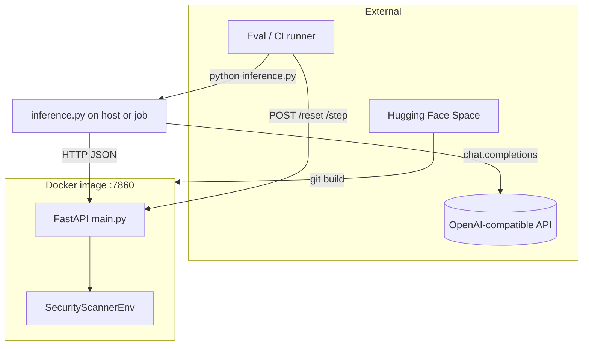
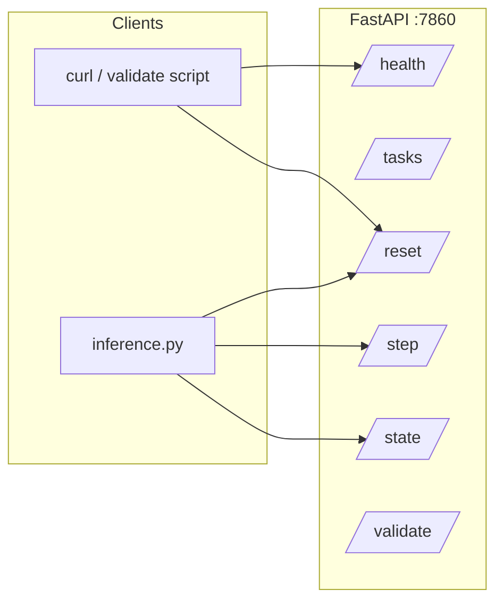
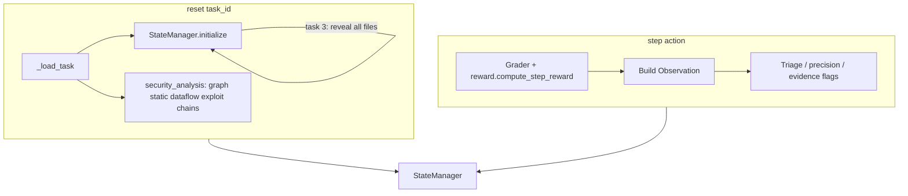
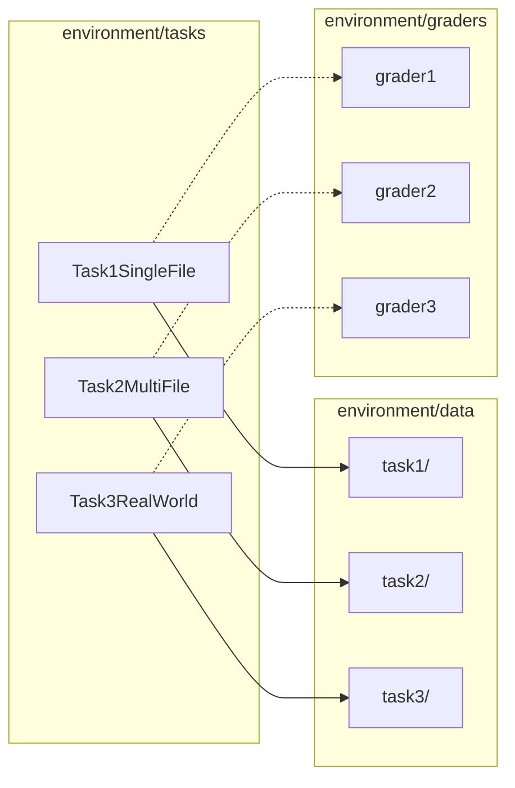
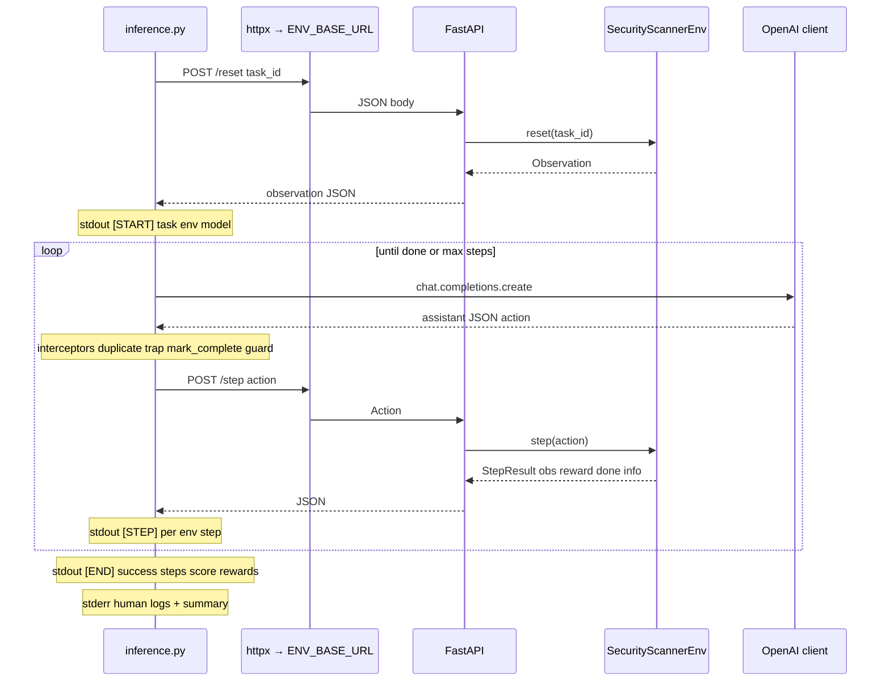
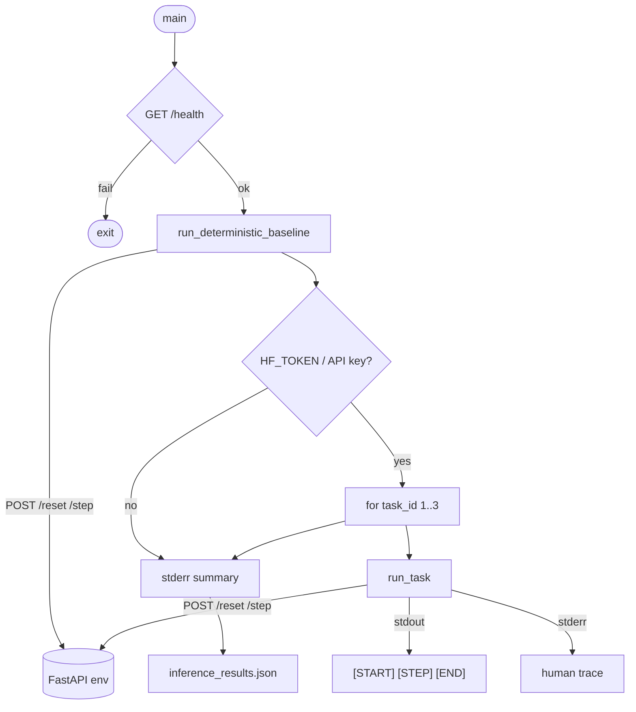
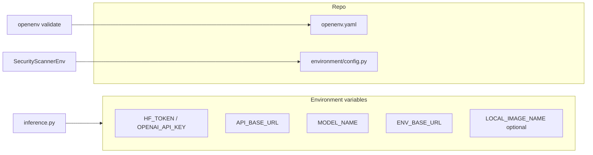

# Security Vulnerability Scanner — Architecture

End-to-end view of deployment, the OpenEnv HTTP server, the Python environment core, and the baseline inference agent (LLM + deterministic scanner).

---

## 1. System context (deployment & actors)

---

## 2. HTTP surface (OpenEnv contract)

---

## 3. Environment core (inside `SecurityScannerEnv`)

---

## 4. Task & data layout

---

## 5. Inference episode sequence (one LLM task)

---

## 6. Dual baseline flow (deterministic then LLM)

---

## 7. Configuration & submission knobs

---

*Generated for Team Suika — OpenEnv Security Vulnerability Scanner.*
